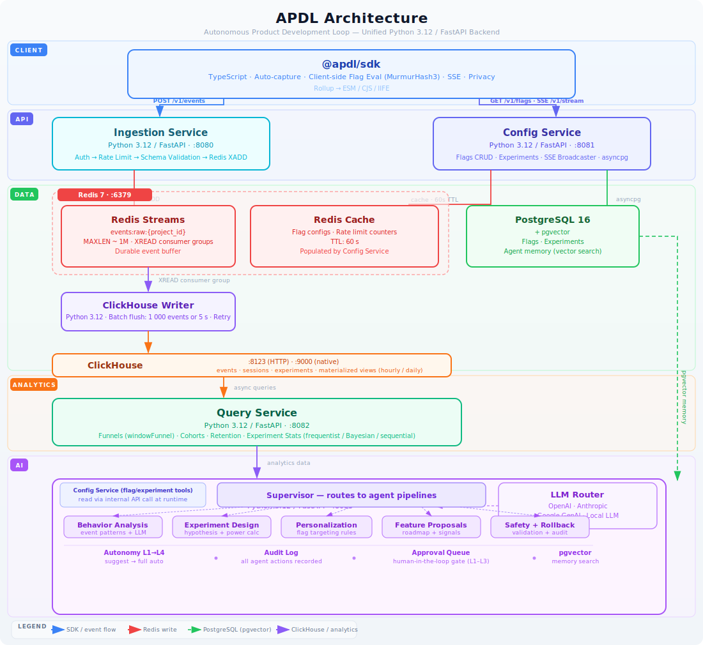

<h1 align="center">APDL</h1>

<p align="center">
  <b>Autonomous Product Development Loop</b> — a self-optimizing product analytics
  and experimentation platform.
</p>

<p align="center">
  <a href="https://github.com/JahaanRawat/apdl/actions/workflows/ci.yml"></a>
  <a href="LICENSE"></a>
  
  
</p>

<p align="center">
  <a href="#quick-start">Quick Start</a> ·
  <a href="#using-the-sdks">SDKs</a> ·
  <a href="#architecture">Architecture</a> ·
  <a href="#api-reference">API Reference</a> ·
  <a href="#autonomous-agents">Agents</a> ·
  <a href="examples/">Examples</a> ·
  <a href="CONTRIBUTING.md">Contributing</a>
</p>

---

APDL ingests user behavior events, runs analytics queries, evaluates feature
flags and A/B experiments, and uses LLM-powered agents to autonomously generate
insights, design experiments, and personalize user experiences. The name is the
data flow:

> **events in → analytics out → agents act on flags & experiments → SDKs pick
> up the changes → new events in…** — that feedback cycle is the *Loop*.

## Quick Start

Prerequisites: [uv](https://docs.astral.sh/uv/), Docker, Node.js 20+, Python 3.12+.

```bash
git clone https://github.com/JahaanRawat/apdl.git && cd apdl
make setup               # venvs + deps for every package, infra containers, migrations, .env
scripts/dev.sh up-full   # full stack in Docker (detached)
scripts/dev.sh smoke     # end-to-end check: ingest event → create flag → query it back
```

`scripts/dev.sh` is the master script for everything local:

| Command | What it does |
|---|---|
| `scripts/dev.sh setup` | Full local setup (same as `make setup`) |
| `scripts/dev.sh up` | Start infra deps only (Redis, ClickHouse, PostgreSQL) + migrations |
| `scripts/dev.sh up-full` | Full stack in Docker (detached) + migrations |
| `scripts/dev.sh status` | Container status + service health endpoints |
| `scripts/dev.sh smoke` | End-to-end smoke test against the running stack |
| `scripts/dev.sh check` | Lint + test every package in parallel |
| `scripts/dev.sh logs [svc]` | Tail Docker logs |
| `scripts/dev.sh down` / `reset` | Stop everything / also wipe data volumes |

To work on one service with hot-reload, start the deps and run it directly:

```bash
make dev            # infra deps only
make run-ingestion  # :8080   (also: run-config :8081, run-query :8082,
                    #          run-agents :8083, run-pipeline)
```

## Using the SDKs

API keys follow `proj_{project_id}_{secret}` (secret: 16+ alphanumeric chars).
Both SDKs evaluate feature flag variants **locally** with a byte-for-byte identical
FNV-1a hash — a user buckets the same way in the browser, on your server, and
in the config service. Runnable samples live in [`examples/`](examples/).

### JavaScript (browser) — [`@apdl/sdk`](sdk/javascript/README.md)

For full SDK usage, see [`sdk/javascript/README.md`](sdk/javascript/README.md).

```typescript
import { APDL } from '@apdl/sdk';

const apdl = APDL.init({
  endpoints: {
    ingestion: 'http://localhost:8080',
    config: 'http://localhost:8081',
  },
  auth: {
    clientKey: 'proj_apdl_0123456789abcdef',
  },
  autoCapture: true,                     // clicks, page views, forms, scroll depth, rage clicks
  privacyMode: 'standard',              // 'standard' | 'cookieless' | 'strict'
});

apdl.track('purchase_completed', { product_id: 'sku-123', revenue: 49.99 });
apdl.identify('user-42', { email: 'user@example.com', plan: 'pro' });

const checkoutVariant = apdl.getVariant('new-checkout-flow');

if (checkoutVariant === 'treatment') {
  // Show the treatment experience.
}
```

→ [Full JS SDK docs](sdk/javascript/README.md): configuration, privacy
controls, server-driven UI, real-time flag subscriptions.

### Python (server-side) — [`apdl-sdk`](sdk/python/README.md)

```python
from apdl import APDL

with APDL.init(api_key="proj_demo_0123456789abcdef") as client:
    client.track("order_completed", {"total": 42.0}, user_id="u_123")
    client.identify("u_123", {"plan": "pro"})

    if client.get_variant("new-checkout", user_id="u_123") == "treatment":
        ...  # treatment experience
```

→ [Full Python SDK docs](sdk/python/README.md): batching, variant-result
explanations, configuration.

## Architecture

<p align="center">
  
</p>

Written walkthrough of the components and the three data flows (events, flags,
the agent loop): [docs/architecture.md](docs/architecture.md).

| Container | Port | Description | Docs |
|---|---|---|---|
| `ingestion` | 8080 | Event ingestion → Redis Streams | [README](services/ingestion/README.md) |
| `config` | 8081 | Feature flags & experiments, SSE | [README](services/config/README.md) |
| `query` | 8082 | Analytics queries on ClickHouse | [README](services/query/README.md) |
| `agents` | 8083 | Autonomous AI agents | [README](services/agents/README.md) |
| `clickhouse-writer` | — | Redis Streams → ClickHouse pipeline | [README](pipeline/README.md) |
| `redis` | 6379 | Event streams + cache | — |
| `clickhouse` | 8123 / 9000 | Analytics store (HTTP / native) | — |
| `postgres` | 5432 | Config store + pgvector | — |

<details>
<summary><b>Tech stack by layer</b></summary>

| Layer | Technology |
|---|---|
| Browser SDK | TypeScript, Rollup, Vitest |
| Python SDK | Python 3.12, httpx, Pydantic |
| Ingestion Service | Python 3.12, FastAPI, Redis Streams, Pydantic |
| Config Service | Python 3.12, FastAPI, asyncpg, Redis, SSE, Pydantic |
| Query Service | Python 3.12, FastAPI, ClickHouse, SciPy, NumPy |
| Agents Service | Python 3.12, FastAPI, OpenAI/Anthropic/Google GenAI SDKs, pgvector |
| Event Pipeline | Redis Streams (Phase 1–2), Kafka (Phase 3+) |
| Analytics Store | ClickHouse (MergeTree, materialized views) |
| Config Store | PostgreSQL 16 + pgvector |
| Infrastructure | Docker Compose, GitHub Actions |

</details>

<details>
<summary><b>Project layout</b></summary>

```
apdl/
├── sdk/javascript/          # @apdl/sdk — TypeScript client SDK
│   └── src/                 # core, capture, flags, sse, ui, privacy
├── sdk/python/              # apdl-sdk — server-side Python client SDK
│   └── apdl/                # client, batching event queue, flags
│
├── services/
│   ├── ingestion/           # Event ingestion + validation → Redis Streams
│   ├── config/              # Flags & experiments CRUD, Redis cache, SSE
│   ├── query/               # Funnels, cohorts, retention, experiment stats
│   └── agents/              # Agent graphs, LLM router, memory, tools, safety
│
├── pipeline/
│   ├── redis/               # Redis Streams → ClickHouse event writer
│   ├── etl/                 # Custom-events ETL framework (canonical envelope → v2 tables)
│   ├── kafka/               # Kafka topic definitions (Phase 3+ migration)
│   └── clickhouse/          # Schemas + migrations
│
├── examples/                # Runnable browser + Python end-to-end samples
├── fixtures/                # Cross-SDK golden values (gate bucketing parity)
├── scripts/                 # dev.sh (master setup/run/test), check.sh, fmt.sh
├── infra/docker/            # Docker Compose (deps + full stack)
├── .github/workflows/       # CI (lint + test) and Release (npm + PyPI + Docker)
└── Makefile                 # Build, test, lint, migrate, dev orchestration
```

</details>

## Development

| Task | Command |
|---|---|
| Lint + test everything in parallel (CI mirror) | `make check` |
| All tests / all linters | `make test` / `make lint` |
| Auto-format all packages | `make fmt` |
| One package | `make test-<pkg>` / `make lint-<pkg>` — `sdk`, `sdk-python`, `ingestion`, `config`, `query`, `agents`, `etl` |
| Build the JS SDK | `make build` |
| ClickHouse migrations | `make migrate-clickhouse` |
| Health overview / smoke test | `make status` / `make smoke` |
| Stop containers | `make dev-down` |

Run a single test while iterating:

```bash
cd sdk/javascript && npm test -- core/client.test.ts
cd services/query && .venv/bin/python -m pytest tests/test_funnels.py -v
```

See [CONTRIBUTING.md](CONTRIBUTING.md) for conventions, the PR workflow, and
the cross-SDK parity rules.

## API Reference

Condensed reference — each service README has full request/response details
and `curl` examples.

### Ingestion (`:8080`) — [full docs](services/ingestion/README.md)

| Method | Path | Description |
|---|---|---|
| `POST` | `/v1/events` | Ingest event batch (1–500 events, returns `202`) |
| `GET` | `/health` | Health check |

### Config (`:8081`) — [full docs](services/config/README.md)

| Method | Path | Description |
|---|---|---|
| `GET` | `/v1/flags` | Flags for a project (SDK bootstrap, Redis-cached) |
| `GET` | `/v1/stream` | SSE stream for real-time flag updates |
| `POST` | `/v1/evaluate` | Server-side gate evaluation (internal token) |
| `GET/POST` | `/v1/admin/flags` | List / create flags |
| `PUT/DELETE` | `/v1/admin/flags/:key` | Update / archive flag |
| `GET/POST` | `/v1/admin/experiments` | List / create experiments |
| `PUT/DELETE` | `/v1/admin/experiments/:key` | Update / delete experiment |
| `GET` | `/health` | Health check |

The admin API also covers stale-flag reports, system disable, cleanup, and
per-flag audit history — see the [config service README](services/config/README.md).

### Query (`:8082`) — [full docs](services/query/README.md)

| Method | Path | Description |
|---|---|---|
| `POST` | `/v1/query/events/count` | Count one or more event selectors |
| `POST` | `/v1/query/events/timeseries` | Time-bucketed counts for one selector |
| `POST` | `/v1/query/events/breakdown` | Property breakdown for one selector |
| `POST` | `/v1/query/funnel` | N-step funnel analysis (windowFunnel) |
| `POST` | `/v1/query/cohort` | Cohort analysis |
| `POST` | `/v1/query/retention` | Retention curves |
| `GET` | `/v1/query/experiment/:id?metric=…&flag_key=…` | Experiment results with statistical tests (`flag_key` required) |
| `POST` | `/v1/query/guardrails/evaluate` | Evaluate flag guardrails |
| `GET` | `/health`, `/ready` | Health / readiness |

Query endpoints use a strict `EventSelector` shape — filters within one
selector are `AND`-combined; operators are `eq`, `neq`, `in`, `not_in`,
`exists`, `not_exists`, `contains`, `gt`, `gte`, `lt`, `lte`:

```json
{
  "event_name": "$click",
  "filters": [
    {"property": "href", "operator": "eq", "value": "/pricing"}
  ]
}
```

<details>
<summary><b>More query examples</b> — count, timeseries, breakdown, funnel, retention, cohort</summary>

Count clicks to a specific URL:

```json
{
  "project_id": "apiasport",
  "start_date": "2025-01-01",
  "end_date": "2025-01-31",
  "selectors": [
    {
      "event_name": "$click",
      "filters": [{"property": "href", "operator": "eq", "value": "/catalog"}]
    }
  ]
}
```

Timeseries for one CTA:

```json
{
  "project_id": "apiasport",
  "start_date": "2025-01-01",
  "end_date": "2025-01-31",
  "interval": "1 DAY",
  "selector": {
    "event_name": "$click",
    "filters": [{"property": "text", "operator": "eq", "value": "Start free trial"}]
  }
}
```

Breakdown of filtered clicks:

```json
{
  "project_id": "apiasport",
  "start_date": "2025-01-01",
  "end_date": "2025-01-31",
  "selector": {
    "event_name": "$click",
    "filters": [{"property": "page.path", "operator": "eq", "value": "/pricing"}]
  },
  "property": "href",
  "limit": 20
}
```

Page/click-path funnel:

```json
{
  "project_id": "apiasport",
  "start_date": "2025-01-01",
  "end_date": "2025-01-31",
  "steps": [
    {
      "event_name": "$pageview",
      "filters": [{"property": "path", "operator": "eq", "value": "/catalog"}]
    },
    {
      "event_name": "$click",
      "filters": [{"property": "href", "operator": "eq", "value": "/checkout"}]
    }
  ],
  "window_days": 7
}
```

Property-filtered retention:

```json
{
  "project_id": "apiasport",
  "start_date": "2025-01-01",
  "end_date": "2025-01-31",
  "cohort_selector": {
    "event_name": "$pageview",
    "filters": [{"property": "path", "operator": "eq", "value": "/pricing"}]
  },
  "return_selector": {
    "event_name": "$click",
    "filters": [{"property": "href", "operator": "eq", "value": "/signup"}]
  },
  "period": "day"
}
```

Filtered cohort comparison:

```json
{
  "project_id": "apiasport",
  "start_date": "2025-01-01",
  "end_date": "2025-01-31",
  "cohort_property": "plan",
  "metric_selector": {
    "event_name": "$click",
    "filters": [{"property": "href", "operator": "eq", "value": "/checkout"}]
  }
}
```

</details>

### Agents (`:8083`) — [full docs](services/agents/README.md)

| Method | Path | Description |
|---|---|---|
| `POST` | `/v1/agents/trigger` | Start an agent run |
| `GET` | `/v1/agents/:run_id/status` | Check run status |
| `POST` | `/v1/agents/:run_id/approve` | Approve a run's pending actions |
| `GET` | `/health`, `/ready` | Health / readiness |

## Autonomous Agents

The agents service runs autonomous analysis workflows powered by LLM reasoning
(via OpenAI, Anthropic, Google, and local model SDKs):

- **Behavior Analysis** — queries ClickHouse to identify trends, anomalies, and conversion patterns
- **Experiment Design** — proposes A/B tests based on behavioral insights, creates flags and experiments
- **Personalization** — configures server-driven UI components per user segment
- **Feature Proposals** — generates product feature suggestions backed by data

Every action passes a safety validator and an autonomy gate, is audit-logged,
and can be rolled back:

| Level | Behavior |
|---|---|
| L1 | Suggest only — surfaces insights for human review |
| L2 | Auto-safe — auto-deploys low-risk changes (e.g., <5% rollout) |
| L3 | Auto + approve risky — auto-deploys safe changes, queues risky ones for approval |
| L4 | Full auto — executes all actions with audit logging |

## Contributing

Contributions are welcome! See [CONTRIBUTING.md](CONTRIBUTING.md) for setup,
conventions, and the PR workflow, and [SECURITY.md](SECURITY.md) for how to
report vulnerabilities. Notable changes are tracked in
[CHANGELOG.md](CHANGELOG.md).

## License

[MIT](LICENSE)
