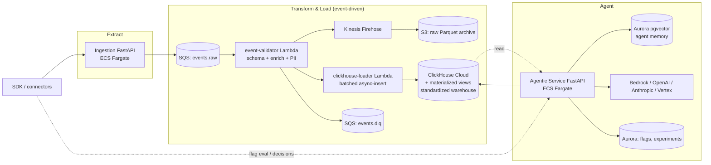
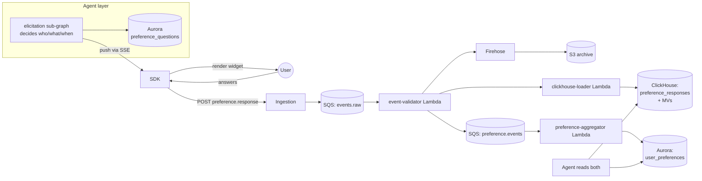

# APDL Enterprise — Technical Design Document

Status: Draft v5 (3-layer ETL + Agent, event-driven on SQS / Lambda / ECS Fargate)
Owner: Platform Architecture
Last updated: 2026-05-29

---

## 1. Executive summary

APDL Enterprise is a multi-tenant SaaS on AWS organized as a **three-layer pipeline**: a data **Extract** layer that collects raw events from customer SDKs and connectors, an **event-driven Transform & Load** layer that standardizes and writes events into the analytics warehouse as they arrive, and an **Agent** layer that reads the standardized data to make and execute product decisions. Everything else (identity, audit, billing, control plane) supports those three. The five most consequential decisions are:

1. **Three layers, each independently scalable, each chosen for its runtime shape.** Extract is ECS Fargate FastAPI (sync HTTP, predictable latency). Transform & Load is **AWS Lambda triggered by SQS** (event-driven, per-message, embarrassingly parallel — events become queryable within seconds, not minutes). Agent is ECS Fargate FastAPI (long-running graph state, streaming LLM responses). The seams are SQS queues and the ClickHouse warehouse — never direct HTTP between layers.
2. **SQS Standard as the layer-to-layer transport, with a Kinesis Data Firehose tee to S3 for replay.** SQS deletes on consume, so the `event-validator` Lambda forks every validated event to Firehose → S3 Parquet for a 25-month rebuildable archive. If the warehouse is corrupted or the schema changes, we replay from S3 to a one-shot SQS replay queue consumed by `clickhouse-loader`.
3. **ClickHouse Cloud Dedicated as the standardized-data layer.** The `clickhouse-loader` Lambda is the only writer; the Agent layer is the only reader for analytics. Pre-aggregations live as ClickHouse materialized views, which trigger on INSERT and stay event-fresh.
4. **Tiered multi-tenancy: pooled for SMB, silo for Enterprise.** Shared Aurora + shared ClickHouse service with `tenant_id` row-keys for SMB; dedicated Aurora DB + dedicated ClickHouse Cloud service per Enterprise tenant; full single-tenant VPC for Regulated. `tenant_id` flows as a JWT claim → SQS message attribute → Lambda enforces → ClickHouse column.
5. **The Agent layer is the only place that talks to LLM providers, via a thin gateway module inside the same FastAPI service.** No separate LLM-gateway microservice in v1 — it is a module the Agent service imports. Splitting it out is a Phase 3 option if egress audit becomes a regulatory requirement.

Estimated MVP: 14 engineer-weeks across 4 engineers. GA: +24 weeks.

---

## 2. Goals and non-goals

### Goals

- Multi-tenant SaaS on AWS, three tiers (SMB pooled, Enterprise silo-per-tenant data, Regulated single-tenant VPC).
- SOC 2 Type II, GDPR, HIPAA BAA-ready by end of phase 2. FedRAMP Moderate is a phase 3 stretch.
- Regions: `us-east-1` and `eu-west-1` at GA; `ap-southeast-2` in phase 3.
- Ingestion target: **300k events/sec aggregate at GA, 1M events/sec by end of phase 3, 50k events/sec per tenant burst** with per-tenant token-bucket quotas.
- Agent-served decision latency P99 < 500ms for flag/experiment evaluation paths; P99 < 30s for autonomous-action workflows.
- Warehouse query P99 < 2s for funnels over 30-day windows on tenants up to 5B events.
- **Warehouse freshness target: P95 ≤ 30 seconds, P99 ≤ 90 seconds** (event ingested → queryable in ClickHouse), bounded by SQS receive + Lambda batch window + ClickHouse async-insert flush.
- 99.95% availability for Extract; 99.9% for Transform/Load end-to-end (event-to-warehouse); 99.9% for Agent.
- RPO ≤ 5 min, RTO ≤ 30 min (Enterprise); RPO ≤ 1 hr, RTO ≤ 4 hr (SMB).

### Non-goals

- On-prem / air-gapped (stays on OSS).
- Real-time (<100ms) feature-store flag evaluation. Client-side hash bucketing is the contract.
- Replacing the OSS license. Enterprise modules sit behind a license boundary in the same monorepo.
- Customer-authored agent skills or code execution. The Agent layer stays a managed surface.

---

## 3. Current state recap and gap analysis

The OSS architecture (per `CLAUDE.md`) is four FastAPI services plus a Python ClickHouse writer, single-tenant, docker-compose:

- `services/ingestion/app/main.py` — events into Redis Streams.
- `services/config/app/main.py` — flag/experiment CRUD + SSE.
- `services/query/app/main.py` — funnels/cohorts/retention.
- `services/agents/app/main.py` — LLM-driven graph with pgvector memory.
- `pipeline/redis/clickhouse_writer.py` — single-process Streams → ClickHouse.

The OSS shape is already the right shape — extract, transform/load, agent — it just isn't multi-tenant, isn't hardened, and the transport is Redis. The enterprise gaps:

| Area | OSS state | Enterprise need |
|------|-----------|-----------------|
| Tenancy | `project_id` string | Tiered isolation: row-level, per-DB, per-VPC |
| Transport | Redis Streams, single node | SQS + Firehose archive |
| Transform | Single-process Python writer | Event-driven Lambda fleet, batched ClickHouse writes |
| Identity | Static API key | SAML/OIDC, SCIM, RBAC, scoped keys, IAM service auth |
| Storage | Local | Aurora + ClickHouse Cloud, PITR, BYOK |
| Secrets | `.env` | Secrets Manager + KMS, rotated |
| Network | Open CORS | VPC, private subnets, PrivateLink, WAF |
| Observability | `logging.basicConfig` | OpenTelemetry → AMP + Grafana + X-Ray |
| LLM | Direct SDK calls | Provider abstraction, cost ceiling, prompt-injection defense |
| Compliance | None | SOC 2, GDPR, HIPAA, tamper-evident audit |
| Release | Manual | CodeDeploy canary, schema migration safety |
| Billing | None | Metering + Stripe + entitlements |
| Admin | None | Control plane: tenant CRUD, break-glass, suspend |

---

## 4. Target architecture

### 4.1 The three layers



Layer responsibilities are strict:

- **Extract** owns the public ingest surface and authentication. It does no transformation beyond schema-level validation. Its output is a raw event on SQS.
- **Transform & Load** owns the canonical event schema. It is the only writer to the ClickHouse warehouse. It enriches (IP → geo, user-agent parsing, session stitching), validates against the schema registry, drops PII per tenant config, and writes to both ClickHouse and the S3 archive.
- **Agent** owns decisions. It reads from the warehouse and from the flag/experiment config store, makes LLM calls, and writes flag/experiment changes back through the same API surface. It exposes the customer-facing analytics and decisioning API.

Anything that does not fit cleanly in one of these three is a supporting service (identity, audit, billing, control plane) and lives off to the side.

### 4.2 Extract layer — Ingestion Service

**Form:** ECS Fargate, FastAPI, Python 3.12, ARM64.

**Why ECS FastAPI:** synchronous HTTP, predictable P99 < 200ms, persistent connection pools to SQS/Redis, no Lambda cold-start tail risk on the customer-visible path.

**API surface:**
- `POST /v1/events` — single event.
- `POST /v1/events/batch` — up to 1000 events.
- `POST /v1/extract/connector/{type}` — webhook intake from third-party connectors (Segment-compatible, Stripe webhooks, etc.).
- `GET /healthz`, `GET /readyz`.

**Responsibilities:**
1. Authenticate the API key, mint a short-lived JWT carrying `tenant_id`, `project_id`, `plan_tier`.
2. Apply per-tenant rate limits via Redis token bucket.
3. Validate against the **input** schema (looser than the canonical schema; we accept and normalize known variants).
4. Stamp `ingested_at_ms`, `ingestion_node_id`, `tenant_id` into the message.
5. Push to SQS `events.raw.{tier}.{region}` via `SendMessageBatch` (10 messages per call, with in-memory 50ms micro-batching).
6. Return `202 Accepted` with the assigned `event_id`. Never blocks on downstream.

**Failure modes:** SQS unavailable → write to `s3://apdl-ingest-fallback-{region}/...` and emit a CloudWatch metric. An S3-event-triggered Lambda re-enqueues once SQS recovers. The SDK always sees 202.

**Scaling:** ECS service auto-scaling on ALB requests-per-target, target 70%. Baseline 6 tasks, ceiling 200. Per-task 1 vCPU / 2 GB. Mix of Fargate (30%) + Fargate Spot (70%) since the service is stateless.

### 4.3 Transform & Load layer — event-driven Lambda pipeline

**Form:** AWS Lambda functions on ARM64, triggered by SQS event source mappings. Per-event processing; events become queryable in ClickHouse within seconds, not minutes.

**Why Lambda for this layer:** the transform work is per-message, embarrassingly parallel, has highly variable load, and benefits from per-invocation concurrency caps to throttle ClickHouse writes. Lambda's pay-per-use suits the burst pattern; provisioned concurrency on the validator covers the cold-start tail on the freshness-critical path. Event-driven semantics give us a P95 ≤ 30s ingest-to-warehouse lag — what the analytics workload actually needs.

**Pipeline stages:**

1. **`event-validator` (Lambda)** — SQS event source mapping, batch size 100, batch window 1s. Validates against the canonical schema from AWS Glue Schema Registry, normalizes shape (maps legacy field names), enriches (MaxMind GeoIP via a bundled DB in the Lambda layer, UA-parser), applies per-tenant PII redaction rules. Outputs the canonical record. Tees a copy to **Kinesis Data Firehose** for the S3 Parquet archive (`s3://apdl-events-raw-{region}/year=.../month=.../day=.../hour=.../`). Routes invalid records to `events.dlq.{region}` with the validation error attached as a message attribute. Hands the canonical batch to:
2. **`clickhouse-loader` (Lambda)** — invoked directly by the validator via the Lambda `Invoke` API with the canonical batch as payload. Batches up to 5000 rows per ClickHouse INSERT, addressed to the per-tenant or per-tier table. Uses ClickHouse async-insert mode so concurrent loaders coalesce server-side. Idempotent by `(tenant_id, event_id)` — re-runs are safe. Retries with exponential backoff on Quorum/Network errors (3 attempts); on persistent failure, the batch lands in `events.dlq` for manual replay.

**Why two Lambdas not one:** keeping enrichment separate from warehouse writes lets us cap the writer's reserved concurrency (100) without backpressuring the validator. ClickHouse hates 10k concurrent writers; 100 well-batched writers with async-insert it handles fine. Splitting them also means a ClickHouse outage doesn't stall the validator — events keep flowing into the S3 archive via Firehose, and we replay the missed window from S3 once ClickHouse recovers.

**Replay path:** S3 archive listing job re-enqueues by date range to a one-shot `events.replay.{region}` SQS queue consumed by `clickhouse-loader` directly (validator skipped — events are already canonical). This is also how we onboard historical data from migrating OSS customers.

**Materialized views for pre-aggregates:** funnel rollups, retention cohort tables, and experiment result summaries are **ClickHouse materialized views** keyed on the `gold_events` table. MVs trigger on INSERT, so dashboards stay event-fresh without an additional orchestration layer. View definitions live in `enterprise/clickhouse/migrations/` and are applied via the schema migration tool described in §8.3.

**Failure modes:**
- Validator dead → SQS messages stay in queue, visibility timeout returns them for retry. After 5 receives → DLQ. PagerDuty alarm on DLQ depth > 0.
- ClickHouse down → loader retries 3x with backoff, then DLQ. Validator keeps running and Firehose archive keeps populating — no data lost, replay window opens on recovery.
- Schema drift → validator returns soft-fail with the row routed to `events.schema-drift.{region}`. A daily CloudWatch-Insights job summarizes the queue and produces a tenant-by-tenant drift report.
- Lambda concurrency throttling → SQS visibility timeout absorbs, retries on next receive; CloudWatch alarm on throttle count > 0 triggers a reserved-concurrency raise runbook.

**Schema ownership:** the canonical schema lives in `enterprise/schemas/events_v1.json`, registered in AWS Glue Schema Registry. Changes go through expand → migrate → contract: v2 schema lands in the registry, `event-validator` validates against both v1 and v2 during the 30-day dual-publish window, then v1 is dropped.

### 4.4 Agent layer — Agentic Service

**Form:** ECS Fargate, FastAPI, Python 3.12, ARM64.

**Why ECS FastAPI:** the agent runs stateful graph workflows (the OSS supervisor/behavior/experiments/personalization pattern), holds streaming LLM connections, and must serve sub-second flag-evaluation requests. Lambda's 15-minute ceiling and lack of persistent connections rule it out.

**API surface (customer-facing):**
- `POST /v1/agents/trigger` — kick off an agent workflow (e.g., "propose three experiments based on last week's funnel").
- `GET /v1/agents/status/{id}` — poll workflow status.
- `POST /v1/agents/approvals/{id}` — approve/reject a proposed action.
- `POST /v1/query/funnel`, `/cohort`, `/retention`, `/experiment/{key}/stats` — analytics queries.
- `GET /v1/flags`, `GET /v1/stream` (SSE) — flag distribution to SDKs.
- `POST/PATCH/DELETE /v1/admin/flags/*` — flag CRUD (RBAC-enforced).
- `POST /v1/agents/decisions/{context}` — synchronous decision endpoint for low-latency personalization callbacks.

**Responsibilities:**
1. Serve analytics queries — middleware injects the `tenant_id` JWT claim into the ClickHouse query as a `WHERE tenant_id = ?` clause, no caller-supplied value trusted.
2. Run agent workflows on the LangGraph-style state machine inherited from OSS, with the autonomy state machine (L1–L4) and safety validator hardened for multi-tenant blast radius.
3. Call LLM providers through an embedded `llm_gateway` module (provider abstraction, per-tenant cost meter to Redis, prompt-injection filter, PII scrubber). Per-tenant ceiling at 110% of plan; soft warn at 80%.
4. Read/write flag and experiment definitions in Aurora.
5. Emit every state-changing action to SQS `audit.events` for the Audit service.
6. Serve flag SSE — long-lived connections held per-task; per-task ceiling ~8k connections.

**Per-tenant routing:** agent workflows are stateful and benefit from memory locality (pgvector). The service exposes a stickiness header (`X-APDL-Tenant`) and uses ECS Service Connect with consistent-hash routing across replicas, so a tenant's workflow tends to land on the same task. Not a hard guarantee; the workflow state is checkpointed to Aurora so any task can resume.

**LLM gateway as a module, not a service:** in v1, `apdl.agent.llm_gateway` is an in-process module imported by the Agent service. It centralizes provider selection, accounting, scrubbing, and the prompt-injection filter, but runs inside the same Fargate task. We will extract it to its own service if (a) auditors require an egress chokepoint outside the agent process, or (b) we want to share it with non-agent services (we don't, today).

**Scaling:** ECS auto-scaling on a composite metric — task CPU + active SSE connections + pending workflow count. Baseline 4 tasks, ceiling 100. Tasks 2 vCPU / 8 GB.

**Failure modes:**
- LLM provider down → automatic failover to secondary provider per tenant policy; failover logged. If all providers fail, queue actions, do not retry hot.
- ClickHouse down → analytics queries return 503; flag eval continues from Aurora + Redis cache.
- Safety validator fails open is forbidden — any safety-validator exception halts the action with `409 SafetyHold`.

### 4.5 Supporting services

Three small services that are not part of the main data flow but are required for enterprise:

**Identity Service** (ECS Fargate FastAPI, in control-plane account)
- SSO (SAML 2.0, OIDC), SCIM 2.0, RBAC, API key issuance, mTLS cert issuance via ACM Private CA.
- Aurora-backed; sessions in ElastiCache.
- Low QPS, 2 tasks per region.

**Audit Service** — Lambda write + thin FastAPI read
- `audit-hashchain` Lambda consumes `audit.events` SQS FIFO (MessageGroupId = `tenant_id`), hash-chains records, writes to ClickHouse `audit_*` + S3 Object Lock Compliance mode.
- Audit Reader API is a small ECS Fargate FastAPI exposing `GET /v1/audit` for Enterprise/Regulated tenants and operators.

**Control-Plane API** (ECS Fargate FastAPI, in control-plane account)
- Tenant CRUD, plan/entitlement assignment, break-glass operations, suspend/reactivate, region pinning, BYOK key registration.
- Aurora-backed.
- 2 tasks; not on the customer hot path.

That is the core service inventory. Three core layers + three supporting services. The next section describes a product capability that layers across them.

### 4.6 Preference elicitation subsystem

**Problem:** the raw behavioral event stream tells us what users *do*, not what they *want*. To make autonomous product decisions that align with user intent — not just engagement metrics — we need a way to ask users directly, store their answers per-user, and aggregate to find what the majority prefers. Stated preferences (what they say) and revealed preferences (what they do) must be triangulated, never confused.

**Architectural fit:** this is not a new layer. It rides on the existing Extract → Transform → Load → Agent pipeline. The only new components are SDK widgets, two new event types, two new database tables, two new ClickHouse materialized views, and an Agent sub-graph. Nothing about Ingestion, the Lambda pipeline, or ClickHouse Cloud changes.

#### 4.6.1 The two-store model

Preferences live in two places because they answer two different questions:

| Store | Purpose | Cardinality | Mutation | Read pattern |
|-------|---------|-------------|----------|--------------|
| **Aurora `user_preferences`** | "What does *this user* prefer?" | 1 row per `(tenant_id, user_id, preference_key)` | Upserted on each response (latest wins) | Point lookup during personalization |
| **ClickHouse `preference_responses` + MVs** | "What does the majority prefer?" | Append-only, one row per response event | Insert-only (events) | Aggregate scan with cohort filters |

The raw response event flows into both — the validator Lambda forks it the same way it forks events into Firehose today.

#### 4.6.2 End-to-end flow



Step by step:

1. The **elicitation sub-graph** inside the Agent service decides a user should be asked a question. It pushes a `prompt.preference` payload through the same SSE channel that delivers flag updates.
2. The **SDK** renders the prompt using a new component family (see 4.6.3) overlaid on the host app. The user answers (or dismisses).
3. The SDK emits a **`preference.response` event** through the normal `POST /v1/events` path. From this point on, it is an ordinary event traveling the standard pipeline.
4. **`event-validator` Lambda** recognizes the canonical preference event shape and additionally publishes a sanitized copy to a new SQS topic `preference.events.{region}`. The original continues to `clickhouse-loader` for warehouse insert.
5. **`clickhouse-loader`** writes the row to `preference_responses` in ClickHouse. Two materialized views fire on INSERT:
   - `preference_aggregates_mv` — rolls up by `(tenant_id, question_id, response_value)` with cohort dimensions (`plan_tier`, `device`, `geo_country`, `signup_cohort_week`).
   - `preference_vs_behavior_mv` — joins the response with the behavioral event stream over a 7-day window so the Agent can spot stated-vs-revealed disagreement.
6. **`preference-aggregator` Lambda** consumes `preference.events` SQS and upserts the canonical "current opinion" row in Aurora `user_preferences`. Reserved concurrency 20.
7. The **Agent** now has two read paths: `user_preferences` for personalizing this specific user, and the ClickHouse MVs for tenant-wide cohort decisions.

End-to-end latency: P95 ≤ 30s for both stores (same as the rest of the event pipeline).

#### 4.6.3 SDK widget extensions

The SDK already supports server-driven UI. Add a new component family `Preference*`:

| Component | Use case | Aggregation |
|-----------|----------|-------------|
| `PreferenceRating` | 1–5 stars or 1–10 NPS | Mean + distribution |
| `PreferenceChoice` | "A or B?" forced choice | Win rate + confidence interval |
| `PreferenceRank` | Rank N options | Borda count |
| `PreferenceText` | Free-text "why?" | LLM-summarized via Agent batch job |

Each widget:
- Renders as a non-blocking overlay; user can dismiss without answering (dismissal is itself recorded as `preference.dismissed`).
- Supports skip-this-question with one tap.
- Respects a per-user rate limit governed server-side (see 4.6.5) — the SDK does not show a prompt that's been rate-limited; the Agent simply doesn't send one.
- Consent-aware: respects the tenant's PII/consent configuration. If `PreferenceText` is collected, the Agent's PII scrubber applies before the response is read by any LLM.

#### 4.6.4 Schemas

**Canonical event — `preference.response` (extends the base event schema in §11.4):**

```json
{
  "event_name": "preference.response",
  "properties": {
    "question_id":     "string  (FK to preference_questions)",
    "prompt_id":       "string  (UUID, distinguishes asks of the same question)",
    "response_type":   "string  (rating | choice | rank | text)",
    "response_value":  "string  (canonicalized: 1-5, A/B, JSON array for rank)",
    "response_text":   "string? (only for PreferenceText, PII-scrubbed)",
    "elicitation_context": "object (cohort, page, session_id, time_of_day)",
    "latency_ms":      "integer (time from prompt shown to answer)"
  }
}
```

Also new: `preference.dismissed`, `preference.skipped`, `preference.shown` (telemetry for response-rate calculation).

**Aurora `user_preferences`:**

```sql
CREATE TABLE user_preferences (
  tenant_id        TEXT NOT NULL,
  user_id          TEXT NOT NULL,
  preference_key   TEXT NOT NULL,            -- derived dimension, e.g. "dark_mode_default"
  current_value    JSONB NOT NULL,
  confidence       REAL NOT NULL,            -- 0..1, weighted by recency + response count
  last_response_id UUID NOT NULL,
  source           TEXT NOT NULL,            -- 'stated' | 'inferred' | 'reconciled'
  updated_at       TIMESTAMPTZ NOT NULL DEFAULT NOW(),
  PRIMARY KEY (tenant_id, user_id, preference_key)
);
CREATE POLICY tenant_isolation ON user_preferences
  USING (tenant_id = current_setting('app.tenant_id'));
ALTER TABLE user_preferences ENABLE ROW LEVEL SECURITY;
```

**Aurora `preference_questions`** (per-tenant, product-team-maintained library):

```sql
CREATE TABLE preference_questions (
  tenant_id        TEXT NOT NULL,
  question_id      TEXT NOT NULL,
  preference_key   TEXT NOT NULL,            -- which user_preferences dimension this updates
  prompt_template  TEXT NOT NULL,
  response_type    TEXT NOT NULL,            -- rating | choice | rank | text
  options_json     JSONB,
  cohort_filter    JSONB,                    -- who is eligible to be asked
  status           TEXT NOT NULL,            -- 'draft' | 'active' | 'archived'
  created_by       TEXT NOT NULL,            -- user_id or 'agent_proposed'
  approved_by      TEXT,                     -- required before 'active' for agent-proposed
  created_at       TIMESTAMPTZ NOT NULL DEFAULT NOW(),
  PRIMARY KEY (tenant_id, question_id)
);
```

**ClickHouse `preference_responses`:**

```sql
CREATE TABLE preference_responses (
  tenant_id        LowCardinality(String),
  project_id       LowCardinality(String),
  user_id          String,
  question_id      LowCardinality(String),
  prompt_id        UUID,
  response_type    LowCardinality(String),
  response_value   String,
  response_text    Nullable(String),
  elicitation_context String,                -- JSON, parsed via JSONExtract
  cohort_segment   LowCardinality(String),
  latency_ms       UInt32,
  timestamp_ms     DateTime64(3),
  ingested_at_ms   DateTime64(3)
)
ENGINE = MergeTree
PARTITION BY toYYYYMM(timestamp_ms)
ORDER BY (tenant_id, question_id, timestamp_ms);
```

**ClickHouse materialized views:**

```sql
CREATE MATERIALIZED VIEW preference_aggregates_mv
ENGINE = AggregatingMergeTree
ORDER BY (tenant_id, question_id, cohort_segment, response_value)
AS SELECT
  tenant_id, question_id, cohort_segment, response_value,
  countState() AS responses,
  avgState(toFloat64OrNull(response_value)) AS mean_rating,
  uniqState(user_id) AS unique_respondents
FROM preference_responses
GROUP BY tenant_id, question_id, cohort_segment, response_value;

CREATE MATERIALIZED VIEW preference_vs_behavior_mv ...
-- joins preference_responses with the 7-day-windowed behavioral stream
-- to flag stated/revealed disagreement
```

#### 4.6.5 The elicitation Agent sub-graph

A new sub-graph in the Agent's LangGraph supervisor. Its job is policy: who to ask, what to ask, when to ask, and what to do with the answers. The actual prompt delivery and response capture are infrastructure (SSE + event pipeline).

**Who to ask** — stratified sampling. Maintains a cohort representation index (`responses_per_cohort / cohort_size`) and biases asks toward underrepresented cohorts. This is the single most important bias mitigation in the design.

**What to ask** — pulls from active rows in `preference_questions` whose `cohort_filter` matches the user. At autonomy L2/L3 the Agent can also *propose* new questions, which land in `preference_questions` with `status='draft'` and `created_by='agent_proposed'` awaiting human approval.

**When to ask** — server-side rate limit, default max 1 prompt / 7 days per user, configurable per tenant. Never during an active workflow (e.g. checkout, onboarding step). Never on first session.

**What to do with answers** — three things happen in parallel:
1. Per-user: `preference-aggregator` Lambda updates `user_preferences`.
2. Tenant-wide: ClickHouse MVs are already updated. The Agent periodically (hourly) scans the aggregate for newly-significant signals.
3. Stated-vs-revealed reconciliation: the Agent reads `preference_vs_behavior_mv` and writes a `source='reconciled'` row to `user_preferences` when both align, or flags disagreement for the dashboard when they don't.

**Action proposals:** when an aggregate response crosses a significance threshold (existing experiment-stats code computes the CI), the Agent can propose flag or experiment changes through the same safety-validator + approval flow every other agent action uses. Example proposal: *"73% of mobile-active users in the EU prefer dark mode default (n=412, CI ±4.2%). Propose rolling out flag `dark_mode_default=true` to that cohort."*

#### 4.6.6 Bias mitigations (the honest part)

These are explicit, documented, and enforced in the Agent code path — not aspirations.

1. **Stated ≠ revealed.** The `preference_vs_behavior_mv` exists so the Agent can never silently override observed behavior with a survey answer. When the two disagree, the Agent's proposal must show both numbers; the safety validator blocks proposals where stated and revealed conflict by more than a configurable threshold (default 25%) without explicit human ack.
2. **Selection bias.** The Agent tracks per-cohort response rates. Aggregate API responses **always** include the cohort composition and response rate, never raw counts alone. The API shape forces UI to show "412 responses from 38% of the mobile-active cohort" rather than "73% prefer X".
3. **Vocal minority.** The aggregate API returns confidence intervals (Wilson score for proportions, t-interval for ratings), not just point estimates. The safety validator rejects proposals based on aggregates with CIs wider than a configurable bound.
4. **Preference fatigue.** Hard rate limit (default 1 prompt / 7 days, but tunable per tenant). The SDK also tracks dismissal rate; users above a dismissal threshold are silently graduated out of the elicitation pool.
5. **Cold start.** Preference elicitation only works on active users. The TDD does not promise to discover what *non-users* want from preference responses — that remains a behavioral-experiment problem. The aggregate API documents this.
6. **Question bias.** Agent-proposed questions require human approval before going active. The approval UI surfaces the question text alongside a leading-question heuristic check (LLM-driven) that flags obvious bias.

#### 4.6.7 Agent API surface (customer-facing)

New endpoints on the Agent service:

- `GET /v1/preferences/users/{user_id}` — returns the user's preference record. Used by customer apps for personalization.
- `GET /v1/preferences/aggregate?question_id=&cohort=` — returns `{response_distribution, mean, confidence_interval, response_count, cohort_size, response_rate}`. Includes cohort composition by construction; UI cannot accidentally hide it.
- `GET /v1/preferences/questions` — list active questions for this tenant.
- `POST /v1/preferences/questions` — create a question (RBAC: requires `flags:edit`).
- `POST /v1/preferences/questions/{id}/approve` — approve an agent-proposed question.
- `POST /v1/preferences/elicit` — manually trigger an elicitation prompt for testing or product-team-driven asks.

All endpoints enforce `tenant_id` via the standard JWT middleware. The aggregate endpoint additionally requires the configured minimum response count (default 30) to be met before returning numbers — under-sampled cohorts return a `low_sample` status, not a misleading point estimate.

#### 4.6.8 Failure modes

- **`preference-aggregator` Lambda dead** → SQS `preference.events` retention covers, replays on recovery. ClickHouse MVs still update from the main event pipeline; only the per-user Aurora row is stale.
- **Aurora `user_preferences` outage** → personalization API returns 503; ClickHouse aggregates still queryable for tenant-wide decisions.
- **Agent over-asks** → the rate-limiter is server-side (in Redis), so even a buggy Agent cannot exceed it. Per-user dismissal tracking gracefully removes hot-stop offenders.
- **A bad question is rolled out** → it can be archived without affecting historical responses; the Aurora row stays for analysis.

#### 4.6.9 Multi-tenancy

Everything is per-tenant. The questions library is per-tenant. The aggregates always filter by `tenant_id`. Cross-tenant aggregation (industry benchmarks: "across all APDL customers, 62% prefer X") is a Phase 3 feature and requires explicit per-tenant opt-in, separate data-processing terms, and anonymization (k-anonymity threshold per tenant before any row is included).

That is the entire service inventory. Three core layers + three supporting services + the preference elicitation subsystem riding across them. Everything else is infrastructure.

---

## 5. Data architecture

### 5.1 Transport — SQS Standard + Firehose archive

**Choice:** SQS Standard, not MSK or Kinesis Data Streams.

**Why:** SQS has effectively no operator surface (no brokers, no partitions, no consumer groups, no rebalance storms). The team is four engineers; we cannot afford Kafka ops.

**Topology:**
- `events.raw.smb.{region}` — SMB tier ingest.
- `events.raw.enterprise.{region}` — Enterprise tier ingest.
- `events.raw.regulated.{tenant_id}.{region}` — one queue per Regulated tenant.
- `events.dlq.{region}` — validation/load failures.
- `events.schema-drift.{region}` — unknown event shapes for daily reporting.
- `events.replay.{region}` — one-shot queue for S3-archive replays.
- `audit.events.{region}` — FIFO, `MessageGroupId = tenant_id`.
- `llm.usage.{region}` — agent emits per-completion usage records (for billing rollup, consumed by `metering-rollup` Lambda).
- `preference.events.{region}` — validator forks `preference.response` events here for the `preference-aggregator` Lambda to upsert Aurora `user_preferences`.

Retention 14 days, visibility timeout 60s (300s for the audit queue), DLQ redrive after 5 receives.

**Throughput math:**
- 300k events/sec aggregate × `SendMessageBatch` 10 = 30k tx/sec on SQS — well within default 3000 tx/sec/API after quota raise.
- 1M events/sec → 100k tx/sec → we shard the queue by `tenant_id % 4` and file the quota raise in Phase 3.

**Replay:** every validated event is teed to **Kinesis Data Firehose** (buffer 5 MB or 60s) → `s3://apdl-events-raw-{region}/year=.../month=.../day=.../hour=.../` as Parquet. To replay: an S3-listing job re-enqueues by date range to the `events.replay.{region}` queue, consumed directly by `clickhouse-loader`.

**Tradeoff:** SQS Standard is unordered. For analytics we order by client `timestamp_ms` in ClickHouse, which is correct. Audit, where ordering matters, uses FIFO. The 300 msg/s/group FIFO ceiling is comfortably above audit volume per tenant.

**Cost reality:** at 300k events/sec the event pipeline costs roughly $10–15k/month AWS (SQS API + validator + loader Lambdas + Firehose). At 1M events/sec, ~$40–55k/month — at that point MSK + a long-running consumer becomes cheaper but adds ~1 SRE FTE. Documented Phase 3 trigger.

### 5.2 Warehouse — ClickHouse Cloud Dedicated

- Per-Enterprise-tenant dedicated ClickHouse Cloud service; shared service for SMB tier with row-level `tenant_id`.
- All event tables: ORDER BY `(tenant_id, project_id, event_name, timestamp)`.
- `clickhouse-loader` Lambda is the only writer.
- Agent service is the only reader; middleware injects `tenant_id` from the JWT claim into every query.
- Retention: 90 days hot, 25 months cold via S3-backed parts. Configurable per tenant.
- Source of truth for rebuild: the S3 Parquet archive.
- **Preference-specific tables:** `preference_responses` (raw response events), `preference_aggregates_mv` (rolled up by cohort + question), `preference_vs_behavior_mv` (joined with the 7-day behavioral window). All keyed on `tenant_id` first. See §4.6.4 for DDL.
- **Materialized views are first-class.** Funnel rollups, retention cohorts, experiment-result summaries, and preference aggregates all live as ClickHouse MVs that trigger on INSERT. MV definitions are checked into `enterprise/clickhouse/migrations/` and deployed via the schema migration tool described in §8.3.

### 5.3 Operational state — Aurora Postgres

- **Aurora Postgres 16** for flag/experiment config, control plane, identity, agent memory and workflow state, and preference state.
- Multi-AZ default; cross-region read replicas for Enterprise.
- PITR 35 days, nightly S3 snapshot.
- Tenancy: SMB pooled with row-level security (`SET LOCAL app.tenant_id`); Enterprise dedicated DB on shared cluster; Regulated dedicated cluster.
- BYOK Aurora encryption with customer KMS for Enterprise/Regulated.
- `pgvector` extension on the agent-memory DB for embeddings.
- **Preference tables:** `user_preferences` (per-user current opinion, RLS-enforced) and `preference_questions` (per-tenant question library, RLS-enforced). Both follow the standard tenancy pattern. See §4.6.4 for DDL. Sized small per tenant — a million users with 20 preference dimensions is 20M rows, well within a single Aurora instance for SMB pooled storage.

### 5.4 Cache & rate-limit — ElastiCache Redis

- Cluster mode, 3 shards, 2 replicas per region.
- Used for: rate-limit token buckets, idempotency keys, flag evaluation cache, SSE connection state, per-tenant LLM cost meter, agent workflow queue.
- Namespaced `t:{tenant_id}:...`.
- Not used for: event buffering (SQS), durable state (Aurora), warehouse (ClickHouse).

### 5.5 Object storage — S3

- `apdl-events-raw-{region}` — Firehose Parquet archive. Standard 30d → IA 90d → Glacier Deep Archive after 1y. Source of truth for replay.
- `apdl-audit-{region}` — Object Lock Compliance mode, 7-year retention.
- `apdl-exports-{region}` — customer exports, presigned URL, 72h lifecycle.
- `apdl-backups-{region}` — Aurora + ClickHouse snapshots.
- `apdl-ingest-fallback-{region}` — Ingestion's SQS-down fallback target; S3 event triggers re-enqueue Lambda.
- All buckets: BPA on, default SSE-KMS, per-tenant CMK for Enterprise prefixes.

### 5.6 Tenancy summary

| Tier | Aurora | ClickHouse | Redis | VPC | KMS | SQS topology |
|------|--------|------------|-------|-----|-----|--------------|
| SMB | Shared DB, RLS | Shared service | Shared, namespaced | Shared | APDL-managed | Shared tier queue |
| Enterprise | Shared cluster, dedicated DB | Dedicated service | Shared, namespaced | Shared | BYOK | Shared tier queue |
| Regulated | Dedicated cluster in tenant VPC | Dedicated service in tenant VPC | Dedicated cluster | Dedicated | BYOK + HSM | Per-tenant queue |

`tenant_id` flow: SDK API key → Ingestion JWT mint → SQS message attribute → Transform Lambda enforces → ClickHouse `tenant_id` column. Agent middleware injects the same claim on every read. One shared `apdl-tenancy` lib; one chokepoint per layer.

---

## 6. Cross-cutting concerns

### 6.1 Identity and access

- **SSO:** SAML 2.0 and OIDC via Identity service.
- **SCIM:** SCIM 2.0 provisioning.
- **RBAC:** Owner, Admin, Editor, Viewer built-in; customer-defined roles in Enterprise. Decision logic via Open Policy Agent as an ECS sidecar; policies pulled from Identity at boot.
- **API keys:** scoped, Argon2-hashed at rest, IP allowlist optional, shown once.
- **Service-to-service auth:** **IAM SigV4 for AWS service calls + ACM Private CA-issued mTLS for cross-service HTTP**. Each ECS task assumes a task IAM role with a least-privilege policy listing exactly which SQS queues, Aurora secrets, and ClickHouse credentials it may access. Lambda execution roles are similarly scoped.

### 6.2 Secrets and KMS

- **AWS Secrets Manager** for all runtime secrets (DB passwords, LLM provider keys, mTLS keys). 30-day rotation via Lambda rotators.
- **AWS KMS** multi-region keys. Platform CMK per region (SMB); per-tenant CMK (Enterprise); customer-imported via KMS External Key Store on CloudHSM (Regulated).
- **No long-lived static credentials.** ECS task roles, Lambda execution roles, OIDC federation from GitHub Actions to deploy roles.
- **Image signing:** Cosign with AWS Signer. ECS task defs and Lambda images reference signed digests, never `:latest`. SBOM via Syft attached at build.

### 6.3 Networking

Per data-plane region:
- One VPC, three AZs, three subnet tiers: public (ALB), private-app (ECS tasks, Lambda ENIs), private-data (Aurora, ElastiCache).
- **No public egress from private subnets.** Centralized egress VPC with NAT Gateways + Network Firewall enforcing an egress allowlist (LLM provider hostnames, Stripe, observability endpoints).
- **PrivateLink** for STS, KMS, Secrets Manager, S3, ECR, SQS, SNS, CloudWatch Logs, ClickHouse Cloud, Bedrock.
- **Customer PrivateLink:** Enterprise customers can consume the Ingestion endpoint over PrivateLink from their AWS account.
- **WAF + Shield Advanced** on the public ALB and CloudFront.
- **Security Groups:** default-deny inbound; ECS tasks accept only from ALB SG; Aurora/ElastiCache only from task SGs.

### 6.4 Observability

- **OpenTelemetry SDK** in every FastAPI service and Lambda (ADOT layer). OTLP collector runs as an ECS sidecar container.
- **Metrics:** Amazon Managed Service for Prometheus + Amazon Managed Grafana (PromQL-native; AMP costs predictably vs CloudWatch metric explosion).
- **Traces:** AWS X-Ray.
- **Logs:** CloudWatch Logs, 30-day retention, archived to S3 via Firehose for 1-year lookback. Structured JSON via `structlog`.
- **SLO dashboards** with burn-rate alerts (1h fast, 6h slow) per service.
- **Layer-specific dashboards:**
  - Extract: ALB req rate, P99 latency, 4xx/5xx rate, SQS SendMessage success rate.
  - Transform: SQS `ApproximateAgeOfOldestMessage`, validator invocations/throttles/errors, DLQ depth, end-to-end ingest-to-warehouse lag.
  - Agent: workflow queue depth, LLM provider latency per provider, per-tenant cost meter, action-approval queue depth.
- **Runbooks** in `runbooks/{service}/{alert-name}.md`.

### 6.5 Compliance

- **SOC 2 Type II:** end of Phase 2. Drata or Vanta for evidence. Controls map to AWS Config, CloudTrail, GuardDuty, Security Hub.
- **GDPR:** EU residency via `eu-west-1`. DSR deletion API fans out across Ingestion (drop further events for `user_id`), Transform (skip on validator), ClickHouse (TTL delete by `user_id` partition), Aurora, pgvector, S3 archives. SLA 30 days.
- **HIPAA:** BAA-eligible AWS services only in Regulated tier. SQS, Lambda, ECS Fargate, Aurora, ElastiCache, S3, KMS, CloudWatch, Bedrock are BAA-eligible. ClickHouse Cloud BAA must be negotiated separately — flagged as risk.
- **Tamper-evident audit:** `audit-hashchain` Lambda hash-chains records (FIFO ordering by tenant), writes to ClickHouse + S3 Object Lock Compliance mode. Daily Merkle root published to the customer audit endpoint.

### 6.6 LLM handling (inside the Agent layer)

- **Providers:** Bedrock, OpenAI, Anthropic, Vertex.
- **Provider selection:** Bedrock default for Enterprise/Regulated (residency, BAA); direct providers for SMB (cost). Per-tenant override.
- **Accounting:** every completion records `(tenant_id, model, prompt_tokens, completion_tokens, cost_usd, latency_ms)` → `llm.usage` SQS → billing rollup Lambda → ClickHouse. Hard ceiling 110% of plan, soft warn 80%. Enforcement is in-process inside the Agent service.
- **Prompt-injection defense:** server-templated system prompts; deterministic regex + small classifier model for user content; fenced `<user_input>` blocks; second-pass validator (separate model call) for mutating actions.
- **PII scrubbing:** email/phone/CCN/SSN regex + customer-configurable. Tokens (`<EMAIL_1>`) pre-prompt; un-substituted only on responses returning to the originating tenant.
- **Eval harness:** Promptfoo-style regressions on every prompt or model change. Gates rollout.
- **Rollout:** model versions flagged via APDL's own flag system. Canary tenants → 10/50/100% over 48h.

---

## 7. Deployment topology on AWS

### 7.1 Account structure (AWS Organizations)

```
Root OU
├── Security OU
│   ├── apdl-log-archive
│   ├── apdl-security-tooling
│   └── apdl-audit
├── Shared Services OU
│   ├── apdl-network             (Transit Gateway, egress VPC, Route53 private zones)
│   ├── apdl-shared-ecr          (ECR + image signing)
│   └── apdl-control-plane       (Control-Plane API, Identity, billing)
├── Workloads OU
│   ├── apdl-prod-us-east-1
│   ├── apdl-prod-eu-west-1
│   ├── apdl-stage-us-east-1
│   └── apdl-dev-us-east-1
└── Sandbox OU
    └── apdl-eng-{name}
```

Control plane is one account. Each data-plane region is its own account. Regulated-tier customers each get a separate account from a Control Tower account factory.

### 7.2 Regions and AZs

- GA: `us-east-1`, `eu-west-1`. Phase 3: `ap-southeast-2`.
- Control plane: `us-east-1` only, DR to `us-west-2` (active-passive, RTO 30min).
- Each region: 3 AZs. ECS service spread across AZs. Aurora multi-AZ. ElastiCache multi-AZ.

### 7.3 Compute

**ECS Fargate** (Ingestion, Agent, Audit Reader, Identity, Control-Plane):
- Platform 1.4.0, ARM64.
- ECS Service Connect for discovery and mTLS termination.
- Auto Scaling on ALB request count + custom metrics.
- Task IAM roles scoped per service.
- Capacity providers: `FARGATE` baseline + `FARGATE_SPOT` up to 70% for stateless services (Ingestion).

**Lambda** (event-validator, clickhouse-loader, audit-hashchain, metering-rollup, preference-aggregator, s3-replay-loader, firehose-transform):
- ARM64.
- Provisioned concurrency = 10% of steady-state on hot functions.
- Reserved concurrency per function to bound blast radius (validator 200, loader 100, audit 20, preference-aggregator 20).
- Lambda Destinations to per-function DLQ SQS queues with PagerDuty alarm on depth > 0.
- AWS Lambda Powertools for Python (structured logs, traces, metrics).

### 7.4 Terraform module decomposition

```
infra/terraform/
├── modules/
│   ├── account-baseline/        (IAM baseline, CloudTrail, Config, GuardDuty)
│   ├── network/                 (VPC, subnets, TGW attachment, endpoints)
│   ├── ecs-cluster/             (cluster, capacity providers, Service Connect ns)
│   ├── ecs-service/             (composite: task def, service, ALB target group, autoscaling, IAM)
│   ├── lambda-function/         (composite: function, IAM role, log group, alarms, DLQ)
│   ├── sqs-queue/               (queue + DLQ + alarms + KMS)
│   ├── firehose-to-s3/          (delivery stream + S3 + Glue table)
│   ├── aurora-postgres/         (cluster, params, secrets-manager integration)
│   ├── clickhouse-cloud/        (service via TF provider)
│   ├── elasticache-redis/
│   ├── s3-tenant-bucket/        (per-tenant Enterprise buckets with Object Lock)
│   ├── observability/           (AMP, AMG, OTel collector sidecar, log groups)
│   ├── waf/                     (managed rules + custom rate limits)
│   ├── kms/                     (per-tenant CMK lifecycle)
│   ├── acm-private-ca/          (Private CA + cert rotation Lambda)
│   └── tenant-onboarding/       (composite: per-tenant resources)
├── environments/
│   ├── prod-us-east-1/
│   ├── prod-eu-west-1/
│   ├── stage-us-east-1/
│   └── dev-us-east-1/
└── live/                         (Atlantis-managed state)
```

- State: S3 + DynamoDB lock, per-environment.
- GitOps: Atlantis for `infra/terraform/`. ECS deploys via **AWS CodeDeploy blue/green** triggered by GitHub Actions on image push. Lambda deploys via alias-shift canary.

### 7.5 Environments

| Environment | Purpose | Data | Auto-rebuild |
|-------------|---------|------|--------------|
| dev-us-east-1 | Engineer integration | Synthetic | Weekly |
| stage-us-east-1 | Pre-prod, customer-mirror | Anonymized prod copy | Manual |
| prod-us-east-1 | Production | Real | Never |
| prod-eu-west-1 | Production (EU) | Real | Never |

---

## 8. Migration plan — OSS to Enterprise

### 8.1 Codebase strategy

Single monorepo, license boundary inside it.

```
apdl/
├── services/             # OSS, Apache-2.0
│   ├── ingestion/
│   ├── config/
│   ├── query/
│   └── agents/
├── sdk/                  # OSS
├── enterprise/           # Commercial license
│   ├── extract/                  # Ingestion enterprise wrapper
│   ├── transform/                # Lambdas: validator, clickhouse-loader, preference-aggregator
│   ├── agent/                    # Agent service incl. llm_gateway module + elicitation sub-graph
│   ├── preferences/              # SDK widget defs + question library + Aurora migrations
│   ├── supporting/
│   │   ├── identity/
│   │   ├── audit/
│   │   └── control-plane/
│   ├── tenancy/                  # shared lib
│   ├── schemas/                  # canonical event + config schemas (incl. preference.response)
│   ├── clickhouse/migrations/    # warehouse DDL + MVs (events + preferences)
│   └── billing/
├── infra/                # commercial license
└── pipeline/
    └── redis/            # OSS (single-node default)
```

CI verifies the OSS subtree builds with no `enterprise/` imports. Enterprise consumes OSS services as upstream Python packages from private CodeArtifact.

### 8.2 Existing OSS user → Enterprise

1. **Dual-write extract:** OSS Ingestion reconfigured to dual-write to SQS via an `sqs-producer` mode added to the OSS image behind a feature flag.
2. **Standardize via Transform:** new events flow into Enterprise ClickHouse alongside the customer's existing one.
3. **Cut reads:** Agent service points at Enterprise ClickHouse; analytics API consumed via new endpoint.
4. **Backfill history:** one-shot job exports their ClickHouse to S3, replay queue feeds `clickhouse-loader` to populate the Enterprise warehouse.
5. **Cut writes and SDK:** SDK reconfigured to Enterprise endpoint + tenant API key. OSS infra decommissioned.

Typical migration: 3–6 weeks with hands-on support.

### 8.3 Schema evolution

- Canonical event schema in **AWS Glue Schema Registry** (JSON Schema).
- Producers (Ingestion) register input schemas; Transform validates and maps to canonical.
- Backward-compatible changes auto-rolled. Breaking changes follow expand → migrate → contract with 30-day dual-publish.

---

## 9. Phased delivery plan

Effort is engineer-weeks of a four-person backend team plus 0.5 SRE.

### Phase 1 — Design-partner MVP (14 eng-weeks, ~4 calendar weeks)

Goal: one Enterprise design partner in `us-east-1`, multi-tenant primitives behind flags, SSO + audit + BYOK, BAA-free.

| Workstream | Eng-weeks |
|------------|-----------|
| Terraform baseline: accounts, VPC, ECS cluster, Aurora, ClickHouse Cloud, SQS, Firehose, S3 | 3 |
| `apdl-tenancy` shared lib: JWT, RLS middleware, tenant_id propagation | 1 |
| Extract: Ingestion FastAPI on ECS with SQS producer, rate limit, JWT auth | 2 |
| Transform: `event-validator` + `clickhouse-loader` Lambdas + Firehose archive | 3 |
| Agent: enterprise wrapper over OSS agent + embedded LLM gateway module + RBAC flag CRUD | 3 |
| Identity MVP: OIDC SSO + scoped API keys | 1 |
| Audit Lambda + Reader API: hash-chained writes to ClickHouse + S3 Object Lock | 1 |

Exit: design partner running 30 days, sustaining 25k events/sec, no unresolved sev1 audits.

### Phase 2 — General availability (29 eng-weeks, ~8 calendar weeks)

Goal: open paid signup; SOC 2 Type II window open; `eu-west-1` live; preference elicitation MVP shipped.

| Workstream | Eng-weeks |
|------------|-----------|
| `eu-west-1` data plane + Control-Plane region pinning | 4 |
| SCIM 2.0 + customer-defined roles via OPA | 3 |
| Tiered tenancy: dedicated ClickHouse service provisioning automation | 3 |
| Billing: `llm.usage` rollup + event-count metering → Stripe, entitlements, overage | 4 |
| BYOK + per-tenant CMK lifecycle | 2 |
| GDPR DSR end-to-end | 2 |
| CodeDeploy blue/green for ECS, Lambda alias-based canaries, schema migration tooling | 2 |
| Prompt-injection defense, PII scrubber, eval harness inside Agent | 2 |
| **Preference elicitation MVP: SDK widgets, schemas, validator fork, `preference-aggregator` Lambda, `user_preferences`/`preference_questions` tables, MVs, elicitation sub-graph, customer API** | 5 |
| SOC 2 evidence collection + policy authoring + pen test | 2 |

Exit: 5 paying tenants, SOC 2 Type II audit window ≥90% complete, EU traffic served from `eu-west-1`, at least one tenant running active preference elicitation in production.

### Phase 3 — Regulated tier + scale (26 eng-weeks, ~8 calendar weeks)

Goal: HIPAA BAA, `ap-southeast-2`, first Regulated customer (per-tenant VPC), headroom to 1M events/sec, cross-tenant preference benchmarks.

| Workstream | Eng-weeks |
|------------|-----------|
| Regulated-tier automation: per-tenant account, VPC, dedicated SQS queues, full data stack | 7 |
| HIPAA controls + BAA + audit | 4 |
| `ap-southeast-2` data plane | 4 |
| Lambda + SQS cost crossover analysis vs MSK/long-running consumer; possible migration plan | 3 |
| SQS quota raises + queue sharding by `tenant_id % N` | 2 |
| Extract `llm_gateway` to its own service if egress chokepoint is required | 2 |
| **Cross-tenant preference benchmarks: opt-in data agreement, k-anonymity pipeline, industry-benchmark API** | 2 |
| Chaos engineering program (AWS FIS) + GameDays | 2 |

---

## 10. Open questions and risks

1. **Lambda + SQS cost at 1M events/sec.** ~$40–55k/month for the event pipeline. MSK + long-running consumer ~$25k/month at the same volume but adds ~1 SRE FTE. Crossover sensitive to per-event payload size. Need real numbers from the OSS user base before Phase 3.
2. **ClickHouse Cloud BAA negotiation.** AWS services in the path are BAA-eligible; ClickHouse Cloud's BAA is separate. If they can't sign, Regulated tier may need self-managed ClickHouse on EKS — a meaningful scope expansion.
3. **SQS quota at 1M events/sec.** AWS will raise SendMessage quotas but we need it pre-negotiated, not at peak.
4. **Per-tenant ClickHouse Cloud provisioning latency** for Enterprise onboarding. Need to validate; warm pool may be required.
5. **Lambda cold-start tail latency** on `event-validator`. Provisioned concurrency mitigates but does not eliminate. End-to-end P99 SLO assumes 10% provisioned — validate under burst.
6. **mTLS on ECS via ACM Private CA.** Cert rotation as a sidecar has edge cases. Phase 1 fallback: signed JWTs with short TTL, deferring mTLS to Phase 2.
7. **OPA for RBAC vs hand-rolled.** One-week prototype on the actual permission model before committing.
8. **Dogfooding APDL on itself.** Circular dependency if the Agent's flag service is down. Need a hard-coded fallback in client libs.
9. **ClickHouse schema migration safety** on 5B-row partitions. Need a documented expand/migrate/contract using ReplacingMergeTree + materialized swap.
10. **Audit FIFO throughput cap.** 300 msg/s per tenant is comfortable today; if a tenant generates >300 audit events/sec we will shard `MessageGroupId` while preserving causal ordering per resource.
11. **LLM gateway as module vs service.** Risk that auditors require an out-of-process egress chokepoint. Phase 3 extraction work item.
12. **Agent autonomy L3/L4 in multi-tenant.** Per-tenant and global kill switches; rollback semantics on Lambda retries (idempotency keys on every side effect).
13. **Stated vs revealed preference reconciliation.** The `preference_vs_behavior_mv` exists, but the threshold at which the safety validator should block a stated-only proposal is a product decision that needs design-partner input. Default placeholder: 25% disagreement triggers human review.
14. **Selection bias in preference responses.** Stratified sampling helps but does not eliminate. The aggregate API exposes cohort response rates by construction — we still need a documented playbook for product teams on how to read low-response cohorts honestly.
15. **Preference fatigue and dismissal escalation.** Default rate limit is 1 prompt / 7 days; we need real customer data to know if this is right. Phase 2 ships with telemetry; Phase 3 tunes.
16. **Agent-proposed question bias.** LLM-generated questions can subtly lead respondents ("Don't you love feature X?"). The leading-question heuristic check is a v1 mitigation, not a guarantee. Phase 2 includes a human-approval-only mode for Regulated tier.
17. **Cross-tenant preference benchmarks** (Phase 3). Requires per-tenant opt-in, k-anonymity threshold tuning, and careful legal review of "industry benchmark" data-handling terms. Treat as a separate product surface, not an automatic feature.

---

## 11. Appendix

### 11.1 Sample Terraform module: `ecs-service`

```
modules/ecs-service/
├── main.tf              # aws_ecs_service + aws_ecs_task_definition (Fargate)
├── alb.tf               # aws_lb_target_group, aws_lb_listener_rule
├── autoscaling.tf       # target tracking (ALB req count) + step (custom metrics)
├── iam.tf               # task role, execution role, scoped policies
├── logs.tf              # CloudWatch log group, retention
├── secrets.tf           # Secrets Manager refs mounted as env
├── otel.tf              # ADOT collector sidecar
├── service-connect.tf   # Service Connect + mTLS from ACM Private CA
├── variables.tf
├── outputs.tf
└── versions.tf
```

Key resources: `aws_ecs_task_definition.this` (ARM64), `aws_ecs_service.this` (Service Connect-enabled, mixed FARGATE + FARGATE_SPOT), `aws_lb_target_group.this`, `aws_appautoscaling_target.this`, `aws_iam_role.task`, `aws_acmpca_certificate.mtls`.

Inputs: `service_name`, `image_uri`, `cpu`, `memory`, `desired_count`, `min_capacity`, `max_capacity`, `secrets`, `environment`, `tenant_tier`, `tags`.

### 11.2 Sample Terraform module: `lambda-function`

```
modules/lambda-function/
├── main.tf              # aws_lambda_function (arm64)
├── trigger.tf           # event source mapping (SQS) or invoke permission
├── iam.tf               # least-privilege execution role
├── alarms.tf            # errors, throttles, DLQ depth, duration P99
├── dlq.tf               # SQS DLQ + alarm
├── provisioned.tf       # provisioned concurrency (optional)
├── variables.tf
├── outputs.tf
└── versions.tf
```

Key resources: `aws_lambda_function.this`, `aws_lambda_event_source_mapping.sqs` (batch size, batch window, maximum_concurrency), `aws_lambda_provisioned_concurrency_config.this`, `aws_sqs_queue.dlq`, `aws_cloudwatch_metric_alarm.*`.

### 11.3 Sample CI/CD pipeline (GitHub Actions → ECR → CodeDeploy)

| Stage | Job | Gate |
|-------|-----|------|
| 1. Lint | `ruff check`, `tsc --noEmit` | block PR |
| 2. Unit test | `pytest`, `vitest` | block PR, 80% coverage |
| 3. Container build | `docker buildx --platform linux/arm64`, push to ECR | block on failure |
| 4. Lambda zip build | `uv pip install --target` + zip; size check | block on failure |
| 5. Image/zip scan | Trivy (HIGH+CRITICAL), license check | block PR |
| 6. SBOM + sign | Syft + Cosign via AWS Signer | block on signing failure |
| 7. Integration tests | LocalStack + ephemeral env; full Extract→Transform→Agent path | block on red |
| 8. Schema check | Glue Schema Registry compatibility | block on breaking change |
| 9. Merge | Squash to main | — |
| 10. Stage deploy | CodeDeploy ECS blue/green (10% canary, 30min hold, 90% shift); Lambda alias canary 10% for 10min | auto-rollback on SLO burn >2x in 15min |
| 11. Stage soak | 24h soak; smoke tests every 5min | manual promotion gate |
| 12. Prod canary (us-east-1) | 5% → 25% → 50% → 100% with 30min steps | auto-rollback on SLO burn |
| 13. Prod (eu-west-1) | Same canary pattern, 2h lag | manual approver |

Cross-cutting:
- GitHub OIDC role into target AWS account; no static AWS keys.
- Schema migrations follow expand → migrate → contract, code gated on expand having completed in prod.
- Hotfix path: `prod-fast-lane` workflow skips stage soak but requires two human approvers and post-deploy SLO check.

### 11.4 Canonical event schema (JSON Schema, Glue Registry)

```json
{
  "$schema": "https://json-schema.org/draft/2020-12/schema",
  "$id": "apdl.events.v1.CanonicalEvent",
  "type": "object",
  "required": ["tenant_id", "project_id", "event_id", "event_name", "timestamp_ms", "ingested_at_ms"],
  "properties": {
    "tenant_id":      {"type": "string", "minLength": 1, "maxLength": 64},
    "project_id":     {"type": "string", "minLength": 1, "maxLength": 64},
    "event_id":       {"type": "string", "format": "uuid"},
    "event_name":     {"type": "string", "minLength": 1, "maxLength": 128},
    "user_id":        {"type": ["string", "null"]},
    "anonymous_id":   {"type": ["string", "null"]},
    "timestamp_ms":   {"type": "integer", "minimum": 0},
    "ingested_at_ms": {"type": "integer", "minimum": 0},
    "session_id":     {"type": ["string", "null"]},
    "properties":     {"type": "object", "additionalProperties": {"type": ["string", "number", "boolean", "null"]}},
    "context": {
      "type": "object",
      "properties": {
        "ip":     {"type": ["string", "null"]},
        "ua":     {"type": ["string", "null"]},
        "geo":    {"type": "object", "properties": {
          "country": {"type": ["string", "null"]},
          "region":  {"type": ["string", "null"]},
          "city":    {"type": ["string", "null"]}
        }},
        "device": {"type": "object"}
      }
    }
  }
}
```

### 11.5 SLO summary

| Layer / Service | Availability | Latency P99 | Error budget (monthly) |
|-----------------|--------------|-------------|------------------------|
| Extract (Ingestion) | 99.95% | 200ms | 21.6 min |
| Transform end-to-end (event → warehouse) | 99.9% | 30s | 43.2 min |
| Agent: `/v1/flags` | 99.95% | 100ms (cache hit) | 21.6 min |
| Agent: SSE delivery | 99.9% | 500ms | 43.2 min |
| Agent: analytics queries | 99.9% | 2s | 43.2 min |
| Agent: workflow trigger → action complete | 99.9% | 30s | 43.2 min |
| Agent: decision endpoint | 99.9% | 500ms | 43.2 min |
| Agent: `/v1/preferences/users/{id}` | 99.95% | 100ms | 21.6 min |
| Agent: `/v1/preferences/aggregate` | 99.9% | 500ms | 43.2 min |
| Preference response → `user_preferences` row (Aurora) | 99.9% | 30s | 43.2 min |
| LLM calls (bounded by providers) | 99.5% | 5s | 3.6 hr |
| Audit emit-to-acknowledge | 99.99% | 1s | 4.3 min |

---

End of TDD.
