# Generalized Codegen Service Improvement Plan

## Objective

Turn product-level requirements into evidence-backed pull requests across
different languages, frameworks, and repository structures.

The coding model remains replaceable. Quality should come from repository
grounding, exact dependency contracts, tests included with the change, GitHub CI
feedback, and bounded repair attempts—not from expecting a stronger model to
compensate for missing evidence.

APDL owns change generation, pull-request creation, CI-failure diagnosis, and
repair commits. GitHub remains the authority for CI verification, reviews,
branch protection, merge queues, auto-merge, and the final merge. The Admin
Console observes and explains that external state; it does not verify or merge
pull requests.

```mermaid
flowchart LR
    A["Task specification"] --> B["Repository profiler"]
    B --> C["Dependency and contract resolver"]
    C --> D["Structured requirement ledger"]
    D --> E["Editing agent with inspection tools"]
    E --> F["Pre-push safety and semantic review"]
    F -->|Actionable rejection| E
    F --> R["Evidence-backed rollout authorization"]
    V["Active operator-verified repository grant"] --> T["Exact repository authority check"]
    R --> T
    T -->|Denied or revoked| O["No GitHub write credential"]
    T -->|Repository-scoped token| G["Create pull request"]
    G --> H["GitHub CI verification"]
    H -->|Failure| I["APDL failure diagnosis"]
    I -->|Repair budget available| M["Repair editor"]
    M --> N["Pre-push safety"]
    N -->|Push repair to same PR| H
    H -->|Passed| J["GitHub reviews and rulesets"]
    J --> K["GitHub merge, auto-merge, or merge queue"]
    H --> L["Admin observes PR and CI status"]
    K --> L
```



## Design Principles

- Prefer exact installed truth over static prompts or model knowledge.
- Treat missing evidence as unknown, never as success.
- Generate tests for observable behavior and let GitHub CI execute them.
- Use one strict canonical schema for each codegen contract.
- Keep repository discovery and validation deterministic where possible.
- Keep models replaceable and route work according to task risk and complexity.
- Preserve a complete evidence trail for every generated change.
- Treat APDL project roles and GitHub repository ownership as separate
  authorities. Only an operator-verified grant for an immutable GitHub
  repository ID can enable repository access.
- Keep the irreversible merge action outside APDL; GitHub repository policy is
  the merge authority.
- Model changeset lifecycle, external CI, repair attempts, and GitHub PR state
  as separate canonical facts rather than overloading one status.

## Repository Authority Prerequisite

**Status: implemented (2026-07-13).** Codegen is private to the service network.
Tenant principals cannot enumerate the shared GitHub App's repositories or
submit repository/installation coordinates. A trusted operator activates a
project-bound grant for one immutable GitHub repository ID. Changesets snapshot
that target, every token lease re-checks it, and installation tokens are
narrowed to the exact repository and operation permissions.

The canonical authority chain is:

```text
APDL principal
  -> same-project active RepositoryGrant
  -> immutable changeset repository snapshot
  -> rollout publication authorization
  -> repository-scoped, minimum-permission GitHub token
  -> branch or PR mutation
```

Repository names are display/locator metadata, never authority. Installation
IDs remain internal to the trusted grant and are neither accepted from nor
returned to tenant callers. Legacy connections remain untrusted until an
operator re-verifies their numeric repository identity.

### Exit Criteria

- Sharing one GitHub App installation cannot let project A bind, enqueue, push,
  poll, or repair repository B.
- Revocation or repository identity drift prevents the next GitHub token lease.
  Immediate cutoff of an already in-flight GitHub token additionally requires
  suspending or uninstalling the App installation on GitHub.
- Rebinding a project cannot retarget an existing changeset.
- Every GitHub token is restricted to the snapshotted repository ID and the
  minimum permissions for its operation.
- Codegen has no host-published Compose port; Agents and Admin reach it only on
  the private service network.

## Phase 0: Close Immediate Escape Routes

**Status: implemented (2026-07-11).** Codegen now observes GitHub CI without
claiming missing signals are green, has no merge endpoint, runs only
deterministic pre-push safety locally, and performs deduplicated bounded repair
commits on the existing PR branch. Agents and Admin no longer expose merge;
Admin links operators to GitHub and displays CI/remediation evidence.

Prioritize safeguards that prevent superficially green changes from shipping.

- Treat “no CI configured” as `unverified_external_ci`, never as `passed` and
  never as a reason to remain in `ci_running` indefinitely.
- Pass repository build, lint, test, and runtime verification to GitHub CI; do
  not treat an APDL-local command run as the authoritative verification result.
- Keep only deterministic pre-push safety gates in APDL, such as non-empty diff,
  secret scanning, protected-path policy, and strict task-schema validation.
- Stop injecting static SDK guidance unless it is tied to an exact installed
  version.
- Make brief and review stages fail closed for medium- and high-risk changes
  when their model call is unavailable or unparseable.
- Remove the codegen merge endpoint, the Admin Console Merge action, and the
  Agents service `merge_pull_request` action.
- Ensure generated changes include appropriate tests for behavior-changing and
  high-risk work when the repository has a test framework.
- Observe GitHub CI failures and feed actionable logs into bounded repair
  attempts on the same PR branch.

### Exit Criteria

- APDL has no endpoint, tool, or UI action that can merge a pull request.
- A missing CI signal remains distinguishable from a successful CI result.
- GitHub CI is the only authoritative verification result shown as passed.
- A no-CI repository advances to an observable PR state rather than remaining
  stuck in `ci_running`.
- A failed CI run either triggers a bounded repair attempt or settles as an
  exhausted, still-open PR requiring human action.

## Phase 1: Build a Canonical Repository Profiler

**Status: implemented (2026-07-11).** A strict `repo_profile@1` schema now
drives both cloned-repository editing context and the GitHub-backed
`repo-context` endpoint. Ecosystem adapters cover Node/TypeScript, Python, Go,
Rust, Gradle/Maven JVM projects, and .NET; fixture tests pin stable output and
explicit uncertainty for conflicts, unresolved versions, truncated snapshots,
and unavailable branch protection.

Replace scattered heuristics with ecosystem adapters that populate one strict
`RepoProfile` schema.

The profile should contain:

- languages, frameworks, package managers, and lockfiles;
- workspace and package boundaries;
- available format, lint, typecheck, build, and test commands;
- test frameworks and browser-testing facilities;
- routes, executable entry points, services, and deployment targets;
- installed dependencies with exact resolved versions;
- CI workflows and branch-protection status;
- repository instructions such as `AGENTS.md`;
- protected or high-risk paths.

Initial adapters:

1. Node.js and TypeScript
2. Python
3. Go
4. Rust
5. JVM with Gradle or Maven
6. .NET

Unknown fields or conflicting package-manager signals should produce an
explicit uncertainty instead of an inferred fallback.

### Exit Criteria

- Fixture repositories for every supported ecosystem produce stable,
  schema-valid profiles.
- Unknown or conflicting repository state is surfaced explicitly.

## Phase 2: Resolve Exact Dependency Contracts

**Status: implemented (2026-07-11).** Exact lockfile inputs are resolved in the
credential-minimal worker, cached by project and content digest, checked for
manifest drift before push, and exposed through strict versioned contract
evidence. Unresolved or ambiguous contracts block dependent work.

Install dependencies in an isolated sandbox before the editing stage, using the
repository lockfile.

For every external package the task depends on, build a `ContractEvidence`
record containing:

- package name and exact version;
- evidence source: installed types, exports, documentation, or implementation;
- relevant symbols and signatures;
- source hash and provenance;
- lifecycle and asynchronous behavior where relevant;
- small compile-checked usage examples.

Rules:

- Installed package truth wins over package HEAD, model knowledge, or static
  service documentation.
- A reference snippet must compile against the exact version before it is shown
  to the model.
- If a package cannot be installed or inspected, the requirement is blocked or
  routed to manual review.
- Generated contract summaries are cached by lockfile hash, not package name
  alone.

### Exit Criteria

- Regression tests cover version drift where repository HEAD and the published
  package expose different APIs.
- Every external API claim presented to the model has versioned provenance.

## Phase 3: Convert Requirements into an Evidence Ledger

**Status: implemented (2026-07-11).** One strict requirement ledger is compiled
before editing, retains stable IDs through same-PR repairs, maps implementation
files and expected GitHub evidence, and prevents PR creation when active
requirements lack implementation evidence or an explicit blocker/descoping
decision.

Replace prose-only engineering briefs with a strict `RequirementLedger`.

Each requirement should include:

- stable requirement ID;
- original source text;
- intended observable behavior;
- repository-implementable scope;
- files or symbols likely involved;
- required contract evidence;
- expected GitHub CI job, test, or observable assertion;
- risk classification;
- implementation status;
- explicit blocker or descoping reason.

Every acceptance criterion must map to:

1. a code change or confirmed existing behavior; and
2. the GitHub CI evidence expected to verify it.

After the PR is opened, `CIVerificationObservation` records attach the actual
GitHub result to the corresponding requirements. Before GitHub reports, the
requirement remains pending rather than verified.

The brief compiler may change implementation details, but it must not silently
weaken requested behavior.

### Exit Criteria

- Every acceptance criterion has an implementation and expected-CI mapping
  before PR creation.
- Unimplementable requirements are explicitly blocked or descoped.

## Phase 4: Give the Editor Real Inspection Capabilities

**Status: implemented (2026-07-11).** Bounded, content-addressed inspection
snapshots and dependency slices cover files, symbols, imports, callers, routes,
tests, lockfiles, and external contracts. The same evidence is retained for
review and repair rather than relying on an untraceable repository-map claim.

A repository map alone is insufficient. The editor should have bounded,
read-only discovery tools before and during editing:

- file and symbol search;
- focused file reading;
- dependency export and type inspection;
- caller, callee, and import tracing;
- route and handler resolution;
- configuration and environment lookup;
- test discovery;
- generated-code and lockfile awareness.

After each edit, automatically construct a dependency slice containing:

- changed files;
- imported local symbols;
- implementations of reused components and helpers;
- destination routes and handlers;
- affected tests;
- relevant external contracts.

The model should never have to assume how a shared component forwards props or
whether a destination route implements the required behavior.

### Exit Criteria

- Every material model assertion can be traced to repository or dependency
  evidence.
- Referenced components, helpers, routes, and package APIs are included in the
  editor or reviewer context.

## Phase 5: Generate Risk-Based Verification Coverage for GitHub CI

**Status: implemented (2026-07-11).** Strict risk/surface policy packs derive a
GitHub verification plan and coverage assessment from the ledger and repository
profile. Missing CI or missing required coverage stays explicitly unverified and
forces a draft PR; it is never treated as an APDL-local pass.

Apply reusable policy packs to decide which tests and CI evidence the generated
change should include. APDL writes or updates the tests; GitHub CI executes them
and remains the verification authority.

| Surface | Required verification |
| --- | --- |
| UI | Render, interaction, accessibility smoke test, responsive browser validation |
| API | Route existence, strict request and response schema, error cases |
| SDK integration | Exact-version contract test, lifecycle, readiness, and cleanup |
| Analytics and experiments | Canonical event, real sink, identity consistency, exposure and metric tests |
| Database | Migration execution, rollback or forward compatibility, real database test |
| Security and authentication | Unauthorized and authorized paths, secret and permission checks |
| Billing and money | Decimal, rounding, idempotency, and retry tests |
| Concurrency | Race, retry, uniqueness, and transaction tests |

For behavior-critical changes, “repository has no test runner” must not be
reported as verified. The service should either:

- add the repository’s preferred lightweight runner and corresponding GitHub CI
  workflow when that is within task scope;
- add tests to an existing CI-compatible harness; or
- open a clearly marked draft PR with
  `external_ci_status=unverified_external_ci` for human follow-up.

### Exit Criteria

- Seeded integration defects are caught by GitHub CI rather than APDL-local
  verification.
- Every medium- or high-risk change adds the coverage required by its policy
  pack or is explicitly marked unverified.

## Phase 6: Strengthen Semantic Review

**Status: implemented (2026-07-11).** The independent semantic reviewer consumes
the requirement ledger, exact contracts, dependency slice, verification plan,
and deterministic repository facts. Its strict evidence-backed verdict can
reject and retry an edit, and medium/high-risk work fails closed when the review
is unavailable or malformed.

The reviewer should receive more than the diff:

- original requirement ledger;
- exact dependency contracts;
- changed-file dependency slice;
- GitHub CI results and logs from earlier repair attempts, when available;
- CI-produced browser or runtime artifacts where applicable;
- unresolved uncertainty;
- pre-existing failures separated from introduced failures.

Run deterministic checks before an LLM review:

- unreachable additions;
- missing routes;
- dropped event handlers;
- unknown or inconsistent event names;
- unhandled asynchronous readiness;
- duplicate client or lifecycle creation;
- strict-schema violations;
- misleading links or nonexistent destinations;
- resources without cleanup.

The model review should return one canonical `ReviewVerdict` schema with
requirement-level decisions and evidence references. Prefer an independent
reviewer model or independently assembled context so the editor’s mistaken
assumptions are not automatically repeated.

### Exit Criteria

- The regression suite catches asynchronous readiness, package-version drift,
  dropped props, absent metrics, incorrect spatial placement, and missing CI.
- Every review rejection includes actionable, evidence-backed instructions.

## Phase 7: Add GitHub-CI Runtime Acceptance Validation

**Status: implemented (2026-07-11).** Runtime requirements produce a
provenance-bound plan and, only when repository policy authorizes it, one exact
deterministically rendered GitHub Actions workflow. Exact-head runs, bounded and
redacted logs, structured manifests, and safe artifacts are stored as immutable
observations; absent or stale evidence remains unverified and can inform the
same-branch repair loop without becoming an APDL CI result.

For runnable applications, generate the tests and workflow configuration needed
for GitHub CI to start the changed system in an ephemeral environment and
exercise the relevant path. APDL consumes the resulting status, logs, and
artifacts; it does not declare the runtime verification result itself.

Capabilities should include:

- browser automation for UI changes;
- HTTP probes for APIs;
- service containers for databases and queues;
- event and network interception;
- DOM geometry checks for placement requirements;
- console and server-log error collection;
- before-and-after behavioral comparisons for control paths.

Runtime CI jobs should attach screenshots, request traces, emitted events, or
structured measurements to the GitHub check run or workflow artifacts.

### Exit Criteria

- Behavior-changing PRs receive runtime evidence from GitHub CI or remain
  explicitly unverified.
- Control-path regressions are detected in GitHub CI and supplied to the repair
  loop as actionable failure evidence.

## Phase 8: Separate PR Creation from GitHub Merge Authority

**Status: implemented (2026-07-11).** Changeset lifecycle, GitHub PR state,
external CI, and remediation state are separate strict dimensions. Webhooks and
polling project exact-head observations; APDL exposes no merge, rerun, close, or
open-PR abandon control. GitHub alone applies review, branch-protection, merge
queue, auto-merge, and final merge policy.

APDL should create pull requests, observe GitHub CI, and repair actionable CI
failures, but it should neither verify nor merge pull requests. GitHub is the
source of truth for CI results, review state, branch protection, required checks,
merge queues, auto-merge, and the final merge result. The Admin Console is an
observability and diagnostics surface for this state.

Use separate canonical dimensions:

```text
changeset_status:
  queued | cloning | editing | pushing | pr_open | merged | abandoned | error

external_ci_status:
  pending | passed | failed | unverified_external_ci

ci_remediation_status:
  idle | diagnosing | repairing | awaiting_ci | resolved | exhausted

github_pr_status:
  draft | open | merged | closed
```

CI is not a changeset lifecycle stage. A repository without external CI should
settle as:

```text
changeset_status = pr_open
external_ci_status = unverified_external_ci
ci_remediation_status = idle
github_pr_status = open
```

This prevents an infinite `ci_running` state without falsely claiming that CI
passed.

### GitHub-Owned Verification and Merge

- GitHub status checks and workflow jobs are the only authoritative CI result.
- APDL reads check runs, workflow results, annotations, and available logs for
  the exact PR head SHA.
- A passed pre-push APDL safety gate must never be represented as passed CI.
- Let maintainers configure GitHub-native auto-merge or merge queues when they
  want autonomous merging. APDL does not enable or execute either mechanism.
- Update APDL only after GitHub reports that the PR was merged or closed.

### CI Failure Diagnosis and Repair Loop

When GitHub reports a failed check for the current PR head SHA:

1. Claim the failure by `(changeset_id, head_sha, check_suite_id)` so duplicate
   webhook and polling events cannot launch concurrent repairs.
2. Collect failing job names, annotations, log excerpts, and links to complete
   GitHub logs and artifacts.
3. Classify the failure as actionable code failure, likely flaky or
   infrastructure failure, policy failure, or unknown.
4. For an actionable code failure, invoke the editor with the original task,
   current diff, exact dependency evidence, and failing CI output.
5. Push the repair commit to the same PR branch. Do not open a replacement PR.
6. Record the new head SHA, increment `ci_retry_count`, set
   `external_ci_status=pending`, and wait for GitHub CI to run again.
7. For a likely flaky or infrastructure failure, request a GitHub-native rerun
   when supported instead of changing code.
8. After the configured retry budget is exhausted, leave the PR open with
   `external_ci_status=failed` and `ci_remediation_status=exhausted`.

Never repair a failure from an old head SHA after a newer commit has been
pushed. Retry limits should be configurable per repository and bounded by both
attempt count and wall-clock budget.

### PR Synchronization

Handle GitHub pull-request events as observations:

- `ready_for_review` updates `github_pr_status` from `draft` to `open`;
- `synchronize` records the new head SHA, invalidates stale CI observations, and
  sets `external_ci_status=pending`;
- a passed CI result sets `external_ci_status=passed` and, when repairs were
  attempted, `ci_remediation_status=resolved`;
- `closed` with `merged=true` records `changeset_status=merged` and the merge SHA;
- `closed` with `merged=false` records `changeset_status=abandoned`;
- `reopened` restores `changeset_status=pr_open`.

Resolve PR events by repository plus PR number or head SHA, not branch name
alone. Retain periodic GitHub polling as recovery for missed webhooks.

### Admin Console Behavior

Remove the Merge button. Show:

- an “Open PR on GitHub” action;
- draft, open, merged, or closed PR state;
- external CI status;
- CI remediation status, retry count, and the most recent failure diagnosis;
- review and branch-protection observations when available;
- an explicit “External CI is not configured” warning;
- failure diagnosis, repair history, and links to the relevant GitHub runs.

The Admin Console does not expose merge, rerun, retry, close, or abandon actions
for an open PR. GitHub events drive verification and merge state; APDL’s bounded
repair loop reacts automatically to eligible CI failures.

Create immutable `CIVerificationObservation` and `CIRemediationAttempt` records
containing:

- repository, PR number, head SHA, check suite, and check run IDs;
- observed status, conclusion, timestamps, and GitHub URLs;
- failing job names, annotations, and bounded log excerpts;
- failure classification and confidence;
- repair prompt evidence, changed files, resulting commit SHA, and attempt number;
- final retry disposition: awaiting CI, repaired, exhausted, or superseded.

Suggested PR-creation policy:

- Low risk: automatic ready-for-review PR; GitHub CI verifies it.
- Medium risk: automatic draft PR; GitHub reviewers decide when it is ready.
- High risk: draft PR with risk warnings and requested specialist reviewers.
- Missing CI or evidence: create a clearly marked draft PR with
  `external_ci_status=unverified_external_ci`; GitHub maintainers decide how to
  proceed.

### Exit Criteria

- APDL cannot execute a merge through its API, agent tools, or Admin Console.
- APDL cannot mark CI passed; it only records GitHub’s result for an exact SHA.
- GitHub webhook or polling state is sufficient to observe external merges and
  closures accurately.
- No missing or inferred signal is recorded as a successful check.
- Actionable CI failures trigger bounded, deduplicated repair attempts on the
  same PR, while exhausted failures remain visible for human intervention.

## Phase 9: Build Continuous Codegen Evaluations

**Status: implemented (2026-07-11).** A digest-bound multi-stack mutation corpus,
sealed evaluator oracles, strict finite metrics with explicit denominators, and
content-addressed reports support offline and non-publishing shadow runs. PR
publication requires an operator-mounted report/policy bundle bound to the exact
model and codegen revision; the service recomputes a per-request decision before
minting any GitHub write token. Reviewed rollout always creates a draft, while
only an eligible low-risk canary may be ready for review. The default sample and
metric thresholds fail closed; smaller migration corpora require an explicit
operator policy rather than an implicit threshold reduction.

Maintain a multi-stack evaluation corpus with real repositories and synthetic
mutations.

Measure:

- requirement coverage;
- build, lint, and test pass rates;
- behavioral acceptance rate;
- escaped-defect rate after merge;
- reviewer precision and recall;
- revert frequency;
- human correction size;
- retries, latency, and cost;
- first-pass CI success rate and CI-repair success rate;
- flaky or infrastructure failure classification accuracy;
- performance by model, ecosystem, task type, and risk tier.

Roll out changes through:

1. offline regression evaluation;
2. shadow generation without PR creation;
3. PR creation with mandatory review;
4. low-risk ready-for-review PR canary;
5. observation of GitHub-native merges, closures, and reverts;
6. gradual expansion based on escaped-defect rate.

## Model Strategy

Do not begin with a model replacement.

First fix contract provenance, context retrieval, and the GitHub CI repair loop.
Then evaluate models by task class:

- smaller models for profiling and classification;
- general coding models for narrow, well-specified edits;
- frontier or high-reasoning models for cross-cutting or ambiguous work;
- independent models for high-risk semantic review.

A stronger model should improve judgment and recovery, but it must never be the
only defense against incorrect authoritative context.

## Canonical Service Contracts

Introduce one strict schema for each pipeline boundary:

1. `RepositoryGrant` and the read-only `RepositoryConnection` projection
2. `RepoProfile`
3. `ContractEvidence`
4. `RequirementLedger`
5. `ReviewVerdict`
6. `PullRequestObservation`
7. `CIVerificationObservation`
8. `CIRemediationAttempt`
9. `RuntimeAcceptancePlan`
10. `EvaluationRun` and `EvaluationReport`
11. `PublicationAuthorization`

Do not introduce aliases or permissive fallback field names. Version schema
changes explicitly and reject unknown or ambiguous shapes where practical.

## Recommended Implementation Order

1. Establish operator-verified repository grants, immutable changeset targets,
   repository-scoped token minting, and private Codegen networking.
2. Remove merge capability from the codegen API, Agents service, and Admin
   Console; make GitHub the only merge authority.
3. Remove APDL-local verification as a merge or CI authority; retain only
   deterministic pre-push safety gates.
4. Separate changeset lifecycle, external CI, remediation attempts, and GitHub
   PR observation into strict canonical fields.
5. Expand GitHub check, workflow, PR webhook, and polling synchronization.
6. Implement deduplicated CI-failure diagnosis and bounded repair attempts on
   the same PR branch.
7. Implement the exact-version dependency contract resolver.
8. Introduce canonical `RepoProfile` and `RequirementLedger` contracts.
9. Add dependency-slice context retrieval for editing and CI remediation.
10. Generate policy-based tests and runtime workflows for GitHub CI.
11. Replace diff-only review with evidence-backed semantic review.
12. Add the evaluation corpus and staged rollout controls.

## Program-Level Success Criteria

The generalized codegen service is ready for broader autonomous use when:

- no tenant principal can select repository coordinates or installation IDs,
  and every GitHub mutation is bound to an active same-project grant for one
  immutable repository ID;
- at least five ecosystem adapters pass the repository-profile fixture suite;
- all external API guidance is tied to exact installed versions;
- every requirement is mapped to a change and expected GitHub CI evidence;
- APDL has no capability to merge pull requests;
- APDL never records CI as passed without a passed GitHub result for the current
  PR head SHA;
- medium- and high-risk PRs include tests for their risk policy and let GitHub
  CI execute them;
- known integration mutations are caught by semantic review or GitHub CI before
  merge;
- missing CI is never represented as passed CI;
- no-CI repositories settle as `unverified_external_ci` while their changesets
  remain observable as open PRs;
- GitHub merges and closures are reflected accurately through webhooks with a
  polling recovery path;
- actionable GitHub CI failures can be repaired on the same PR within a bounded
  retry budget, without duplicate or stale-head repair attempts;
- model upgrades can be evaluated independently from orchestration changes;
- offline and shadow evaluation cannot receive a GitHub publication capability;
- PR generation and CI repair cannot mint a GitHub write token without a
  persisted authorization bound to the exact evaluated model and codegen
  revision;
- escaped defects and human correction size improve against the existing
  baseline over a representative evaluation set.
